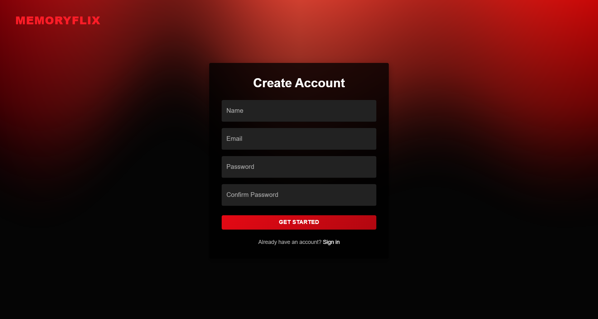
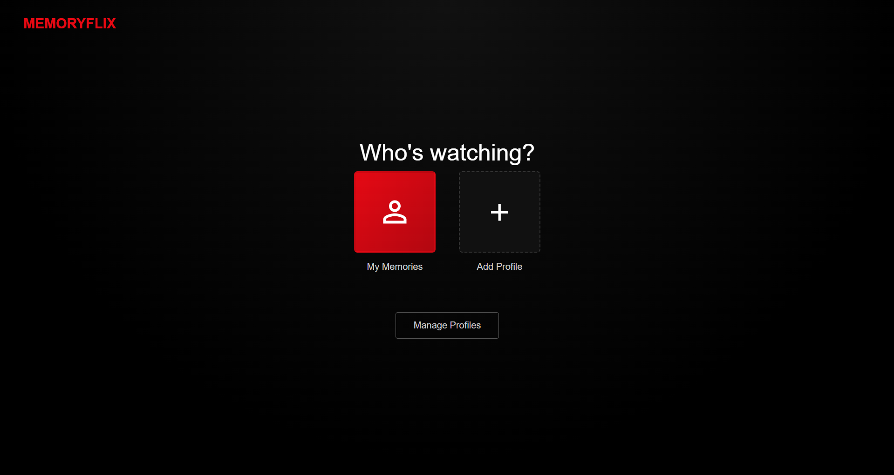
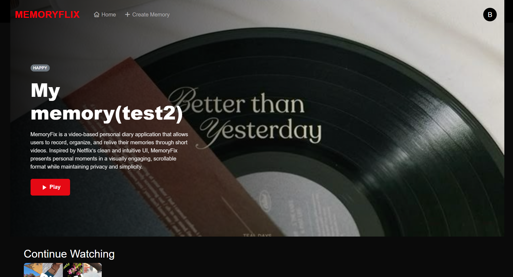
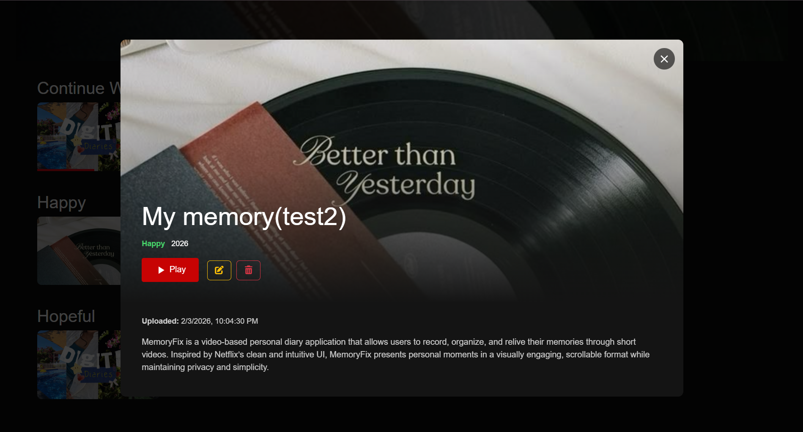

# 🎥 MemoryFlix

Your Personal Video Diary
MemoryFlix is a video-based personal diary application that allows users to record, organize, and relive their memories through short videos. Inspired by Netflix’s clean and intuitive UI, MemoryFlix presents personal moments in a visually engaging, scrollable format while maintaining privacy and simplicity.

Built using the MERN Stack, MemoryFlix focuses on real world usability, performance, and scalable architecture.

---

## 🚀 Features
- 🎬 **Video Diary Entries:** Record and upload short video memories instead of traditional text notes.

- 📂 **Category-Based Organization:** Organize memories by mood, date, or custom categories.

- 📺 **Netflix-Inspired UI:** Horizontally scrollable sections, thumbnails, and smooth transitions for an immersive experience.

- 🔐 **Authentication & Authorization:** Secure user authentication using JWT.
- 📱 **Responsive Design:** Fully responsive UI for mobile, tablet, and desktop devices.

---

## 📸 Screenshots

  

  

  

  

  

